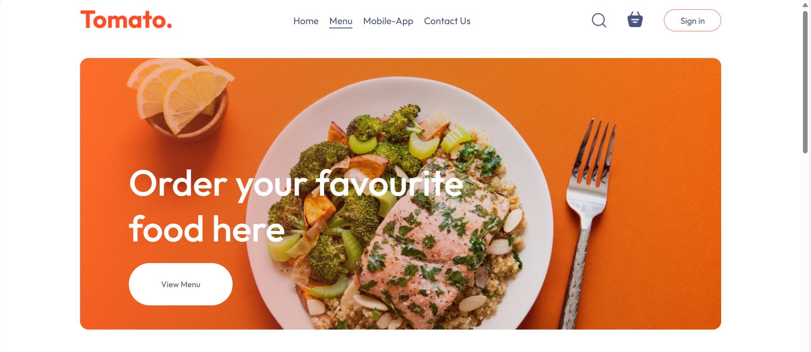
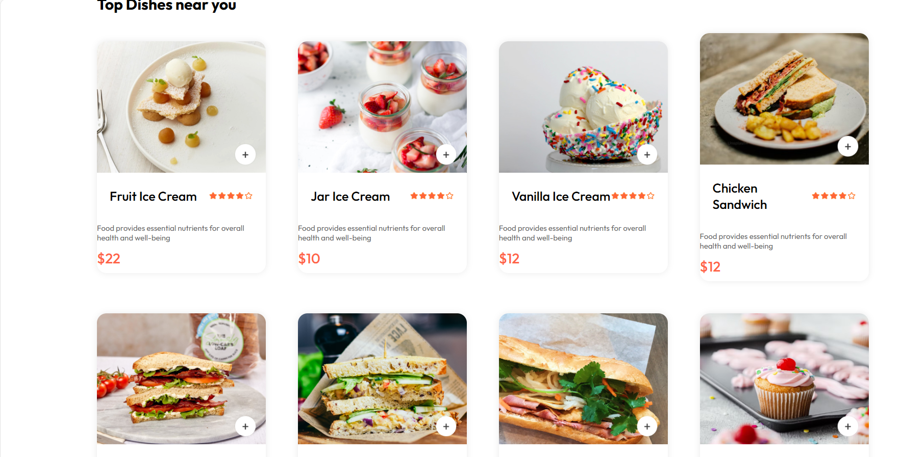

# Food Del - Full Stack Food Ordering Website
<p align="center">
   
   
</p>


**A complete food ordering website/app using React JS, MongoDB, Express, Node JS, and Stripe payment gateway.**  
This project includes a Frontend website, Admin Panel, and Backend server with features such as user authentication, shopping cart functionality, Stripe payment integration, and order status updates.

## Overview

Food Del is a comprehensive food delivery application that allows users to browse menus, place orders, and pay online. It includes a user-friendly frontend built with React JS, a robust backend using Express and Node JS, a MongoDB database for data management, and Stripe for handling payments.

## Features

- **User Authentication:** Secure user registration and login functionality.
- **Shopping Cart:** Add food items to the cart and manage the cart contents.
- **Order Placement:** Seamless order placement with Stripe payment integration.
- **Order Status Updates:** Track the status of orders in real-time.
- **Admin Panel:** Manage food items, view all orders, and update order statuses.

## Technologies Used

- **Frontend:** React JS
- **Backend:** Node JS, Express
- **Database:** MongoDB
- **Payment Gateway:** Stripe


## Installation

### Backend Setup

1. Clone the repository:

    ```bash
    git clone https://github.com/your-repo/food-del.git
    ```

2. Navigate to the backend directory:

    ```bash
    cd food-del/backend
    ```

3. Install backend dependencies:

    ```bash
    npm install
    ```

4. Set up environment variables. Create a `.env` file in the `backend` directory and add the following:

    ```bash
    MONGO_URI=your-mongodb-uri
    STRIPE_SECRET_KEY=your-stripe-secret-key
    JWT_SECRET=your-jwt-secret
    ```

5. Start the backend server:

    ```bash
    npm start
    ```

### Frontend Setup

1. Navigate to the frontend directory:

    ```bash
    cd ../frontend
    ```

2. Install frontend dependencies:

    ```bash
    npm install
    ```

3. Set up environment variables. Create a `.env` file in the `frontend` directory and add the following:

    ```bash
    REACT_APP_STRIPE_PUBLIC_KEY=your-stripe-public-key
    ```

4. Start the frontend development server:

    ```bash
    npm start
    ```

## Usage

### 1. User Flow

- **Authentication:** Users can register and log in to their accounts.
- **Browse Menu:** View available food items and their details.
- **Add to Cart:** Add selected items to the shopping cart.
- **Checkout:** Proceed to checkout, enter payment details, and complete the order using Stripe.
- **Order Status:** Track the status of orders from the user dashboard.

### 2. Admin Flow

- **Admin Access:** Securely access the admin panel using credentials.
- **Manage Food Items:** Add, update, or remove food items from the menu.
- **View Orders:** View a list of all orders placed by users.
- **Update Order Status:** Change the status of orders (e.g., processing, completed).

## Stripe Integration

The application uses Stripe for payment processing. Ensure you have configured your Stripe account and added the necessary API keys to your environment variables.


